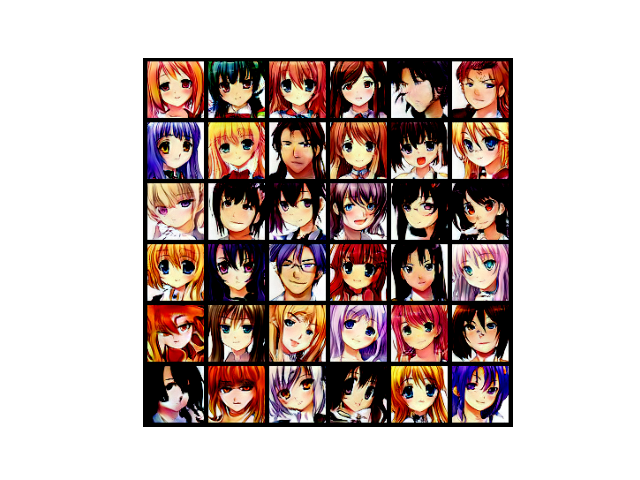

# Anime Generation with StyleGAN2

This repository contains an unoffical implementation of StyleGAN2 for generating Anime Faces. 

<p align="center">
  <br/>
  <i>Result</i>
</p>

## Dataset

This implementation was trained on the [Anime Faces Dataset](https://www.kaggle.com/datasets/soumikrakshit/anime-faces) from Kaggle. which contains 21551 anime faces scraped from [getch.com](www.getchu.com), which are then cropped using the [anime face detection algorithm](https://github.com/nagadomi/lbpcascade_animeface). All images are then resized to 64 x 64 pixels. 

If you wish to use a different dataset, you can modify the `dataset.py` file to load your images. The dataset should be organized as a directory of image files, where each file represents a single image. The images should be of size 64 x 64 pixels.

## StyleGAN2 Architecture

The StyleGAN2 architecture consists of a generator network and a discriminator network, which are trained in an adversarial manner. The generator network takes a random noise vector as input, and produces an image that is evaluated by the discriminator network. The goal of the generator network is to produce images that are realistic enough to fool the discriminator network, while the goal of the discriminator network is to accurately distinguish between real images and generated images.

One of the key features of the StyleGAN2 architecture is its use of adaptive instance normalization (AdaIN) layers, which allow for fine-grained control over the style of the generated images. By adjusting the mean and standard deviation of the feature maps at each layer of the generator network, the AdaIN layers can produce images with different styles, such as different lighting conditions, colors, and textures.

Another important aspect of the StyleGAN2 architecture is its use of progressive growing, which involves gradually increasing the resolution of the images being generated during training. This allows for the generation of high-resolution images with fine details.

## Training

To train StyleGAN2 on your own dataset, you should first modify the configuration settings in the `hyperparameters.yaml` file. This file contains various hyperparameters and settings for the model and training process, such as the learning rate, batch size, and number of training epochs. You can also specify the path to your dataset in this file.

Once you have modified the configuration file, you can start training the model by running the following command:

```bash 
python3 train.py --hyperparameters hyperparameters.yaml
```

This will start the training process using the settings specified in the `hyperparameters.yaml` file. The model will be saved at the end of each epoch, and only the last 5 saved models will be kept to save disk space.

To create the training progress video that shows the images generated by the trained StyleGAN2 model at each epoch use the following commands; 

```bash 
python3 utils/epoch_video.py --images_path path\to\images\generated\at\each\epoch\ --save_path path\of\save\progress\video
```

The images generated at each epoch of training is in `images` directory and the pretrained model is avaiable in `saved_model` directory.

## Result

StyleGAN2 has achieved impressive results in generating high-quality anime faces of 64 x 64 pixels. Here are some of the sample results generated by the trained model : 




The following graph describes the generator loss and discriminator loss during training : 

